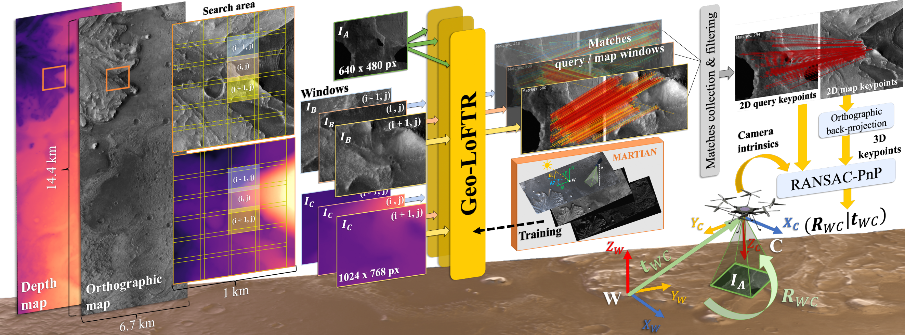
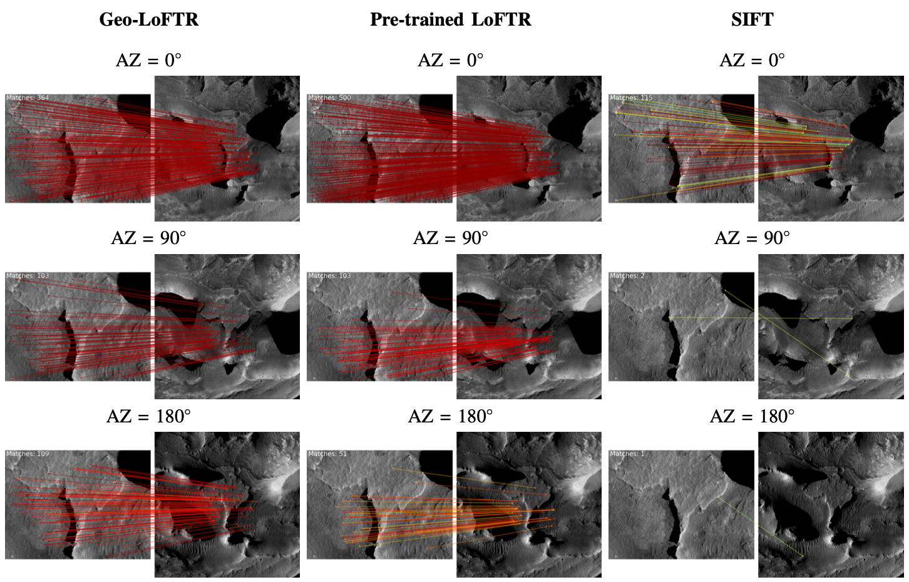
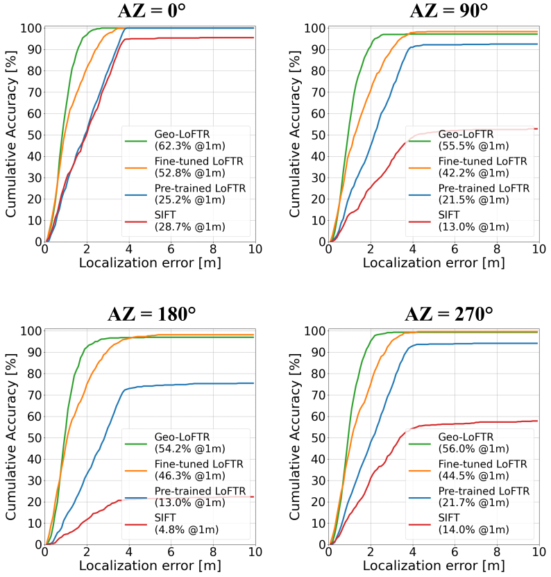
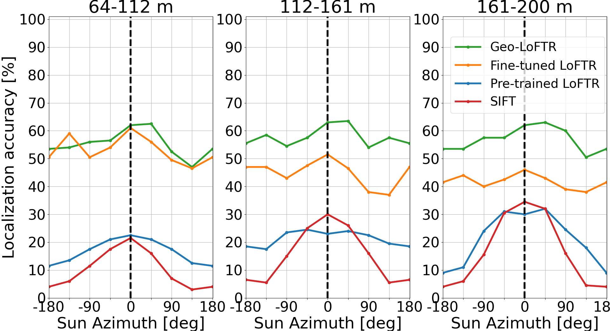

# Source code for the Map-based Localization (MbL) pipeline proposed in:

### Vision-based Geo-Localization of Future Mars Rotorcraft in Challenging Illumination Conditions ([pdf](https://arxiv.org/abs/2502.09795))
Dario Pisanti, Robert Hewitt, Roland Brockers, Georgios Georgakis

### Abstract:
Planetary exploration using aerial assets has the potential for unprecedented scientific discoveries on Mars. While NASA’s Mars helicopter Ingenuity proved flight in Martian atmosphere is possible, future Mars rotocrafts will require advanced navigation capabilities for long-range flights. One such critical capability is Map-based Localization (MbL) which registers an onboard image to a reference map during flight in order to mitigate cumulative drift from visual odometry. However, significant illumination differences between rotocraft observations and a reference map prove challenging for traditional MbL systems, restricting the operational window of the vehicle. In this work, we investigate a new MbL system and propose Geo-LoFTR, a geometry-aided deep learning model for image registration that is more robust under large illumination differences than prior models. The system is supported by a custom simulation framework that uses real orbital maps to produce large amounts of realistic images of the Martian terrain. Comprehensive evaluations show that our proposed system outperforms prior MbL efforts in terms of localization accuracy under significant lighting and scale variations. Furthermore, we demonstrate the validity of our approach across a simulated Martian day.

## Pipeline overview



Given an ortho-projected map of the terrain and a simulated onboard image we aim to estimate the pose of a rotocraft operating on Mars. Assuming a noisy pose prior, a search area is selected that is further divided into smaller regions and passed sequentially to our geometrically-enhanced Geo-LoFTR observation-to-map matcher. Geo-LoFTR is trained from data generated by our simulation framework [MARTIAN](https://link/to/future/MARTIAN/git/repo). Finally, the matches are then filtered and passed to RANSAC-PnP to estimate the pose.

## Example: MbL robustness to Sun Azimuth (AZ) angle

### Matching


<details>
<summary>Figure caption:</summary>
Geo-LoFTR, Pre-trained LoFTR and SIFT matched keypoints displayed for a sample query image (left side of each panel) with (0° AZ, 10° EL) sun angles and a map search area image (right side of each panel) under three different sun elevations and 0◦ azimuth offset. Match lines are color-coded by confidence score, with redder indicating higher confidence. Despite still providing a localization solution in the 0-180° AZ range, the pre-trained LoFTR matches exhibit lower confidence with azimuth changes than Geo-LoFTR, resulting in a coarser localization.
</details>

### Cumulative localization accuracy


<details>
<summary>Figure caption:</summary>
Cumulative distributions of the localization error of simulated Mars
observations at sun AZ=0° and EL=10°, registered onto maps at four different
azimuth angles and 0◦ elevation offset.
</details>

### Localization accuracy @ 1m vs AZ with varying altitude

<details>
<summary>Figure caption:</summary>
Localization accuracy at 1m precision as a function of map sun azimuth for test observations across three altitude ranges. Sun azimuth angles are in the [−180°,180°]range. Map sun angles matching the observations are marked with a thick black vertical line.
</details>

## Prerequisites

Ensure you have Anaconda or Miniconda installed on your system. You can download and install it from the Anaconda website.

https://www.anaconda.com/docs/getting-started/anaconda/install

<details>
      <summary> Anaconda (Linux/macOS - recommended) </summary> 
To install Anaconda on Linux run from terminal:

```
curl -O https://repo.anaconda.com/archive/Anaconda3-2024.10-1-Linux-x86_64.sh
bash ~/Anaconda3-2024.10-1-Linux-x86_64.sh
```

To install Anaconda on macOS with Apple Silicon architecture run:
```
curl -O https://repo.anaconda.com/archive/Anaconda3-2024.10-1-MacOSX-arm64.sh
bash ~/Anaconda3-2024.10-1-MacOSX-arm64.sh
```

or run the following for the Intel architecture:
```
curl -O https://repo.anaconda.com/archive/Anaconda3-2024.10-1-MacOSX-x86_64.sh
bash ~/Anaconda3-2024.10-1-MacOSX-x86_64.sh
```

Close and re-open your terminal window for the installation to fully take effect.
</details>
<details>
      <summary> Miniconda (Linux) </summary> 

These four commands quickly and quietly install the latest 64-bit version of the installer and then clean up after themselves. To install a different version or architecture of Miniconda for Linux, change the name of the .sh installer in the wget command. 

```
mkdir -p ~/miniconda3
wget https://repo.anaconda.com/miniconda/Miniconda3-latest-Linux-x86_64.sh -O ~/miniconda3/miniconda.sh
bash ~/miniconda3/miniconda.sh -b -u -p ~/miniconda3
rm -rf ~/miniconda3/miniconda.sh
```

After installing, initialize your newly-installed Miniconda. The following commands initialize for bash and zsh shells:
```
~/miniconda3/bin/conda init bash
~/miniconda3/bin/conda init zsh
```
</details>

## Setup

Create and activate a new conda environment (python version tested: 3.9.0):

```
conda create -n mbl-env python=3.9
conda activate mbl-env
```

Clone the git repo and install core dependencies:
```
git clone https://link/to/future/mbl_mars/git/repo
cd ~/mbl_mars
conda install --file ./requirements.txt
```

If some packages are not available via conda or there are conflicts, you can alternatively use pip to install them:

```
pip install -r requirements.txt
```

## Data dependencies

To run the MbL pipeline you need to:
- provide ortho-projected maps and query observations data generated in [MARTIAN](https://link/to/future/MARTIAN/git/repo)
- download the [weights](link/to/external/folder/containing/models/weights) folder including the trained models of the observation-to-map matchers, and place it in `~/mbl_mars`.

## Getting started

MbL can be performed on a search area of 1 km<sup>2</sup> centered at the query observation to simulate a conservative scenario with a high-uncertainty pose prior. Alternatively, information on pose prior uncertainty can be provided to execute the geo-localization on a smaller search area.


### Run MbL on search area of 1 km<sup>2</sup>

To evaluate the MbL performance by registering query observations onto a 1 km<sup>2</sup> search area from the map, run from root: 

```
python evaluate_mbl.py --method $METHOD \
            --map_data_path $MAPS_PATH \
            --test_data_path $TESTS_PATH \
            --dest_dir $DEST_DIR \
            --elev_maps $ELEV_MAPS --azim_maps $AZIM_MAPS \
            --elev_tests $ELEV_TESTS --azim_tests $AZIM_TESTS \
            --loftr_model_type $MODEL_TYPE --loftr_config $LOFTR_CONFIG \
            --sift_config $SIFT_CONFIG \
            --shadow_thresh $SHADOW_THRESH --depth_thresh $DEPTH_THRESH

```
<details>
<summary> General arguments info:</summary>

- `--method` (type: str) allows to select the observation-to-map matching models between LoFTR-based and SIFT-based. The $METHOD variable can be:
    ```
    $METHOD = "loftr" (to select LoFTR-based models)
            = "sift" (to select SIFT-based)
    ```

- `--map_data_path` (str): path to the rendered maps directory
- `--test_data_path` (str): path to the directory containing the test query observations
- `--dest_dir` (str): path to destination directory to save the MbL results
- `--elev_maps` and `--azim_maps` (int): List of Sun elevation and azimuth angles for map [deg]. Example:
    ```
    --elev_maps 30 60 90
    --azim_maps 0 90 180 270
    ```
    *note*: on high performance computing clusters (e.g. TACC), run a single combination of Sun angles as following:
    ```
    --elev_maps="5"
    --azim_maps="0"
    ```
- `--elev_tests` and `--azim_tests` (int): List of Sun elevation and azimuth angles for test observations [deg]. Example:
    ```
    --elev_tests 40 60
    --azim_tests 0 180
    ```
    *note*: on cluster, run a single combination of Sun angles as following:
    ```
    --elev_tests="40"
    --azim_tests="180"
    ```
- `--depth_thresh`(float): discards map windows with percentage of invalid depth pixels (i.e. falling in the map bounding box) greater than the value passed to `--depth_thresh` in the 0-1 range.
- `--shadow_thresh`(float): discards map windows with percentage of shaded pixels (i.e. with pixel intensity below 5 in the 0-255 range grayscale) greater than the value passed to `--shadow_thresh` in the 0-1 range.
- If you want to test just a subset of queries from the test set, you can specify the number by adding the `--n` argument followed by an integer number. Otherwise, the whole set will be processed.
</details>
<details>
<summary> LoFTR-related arguments:</summary>

- In case `$METHOD="loftr"` it is possible to select different trained LoFTR models by writing the input argument `--loftr_model_type` (str) as following:
    ```
    --loftr_model_type $MODEL_TYPE 
    ```
    where the `$MODEL_TYPE` variable can be:
    - `"pretrained"`: LoFTR off-the-shelf pretrained model.
    - `"finetuned"`: LoFTR model fine-tuned on datasests generated in MARTIAN from the Jezero crater, and including HiRISE-like maps (0.25 m/px resolution).
    - `"geo"`: Geo-LoFTR model trained on datasests generated in MARTIAN from the Jezero crater, and including HiRISE-like maps (0.25 m/px resolution).
    - `"geo_ctx"` Geo-LoFTR model trained on datasests generated in MARTIAN from the Jezero crater, and including CTX-like maps (6 m/px resolution)

- `--loftr_weight_path` (str): path to the directory containing LoFTR model weights.
- `--loftr_config` (str): path to the .json configuration file for LoFTR-based matching. Default configuarations are stored in `./config`.
- `--resize` (bool): whether to resize images (and depths) before passing them to LoFTR-based models. Default is `True`.
- `--input_img_size` (int): target size for resizing input images to the LoFTR-based models. Default is 640.
- `--df` (int):  Rrsize to dimensions divisible by this factor. Default is 8.
- `--img_padding` (bool): whether to pad images during resizing. Default is True.
</details>
<details>
<summary> SIFT-related arguments:</summary>

- In case `$METHOD="sift"`,  `--sift_config` (str) takes the path to the json configuration file for SIFT feature extraction. Default configuarations are stored in `./config`.
</details>
<details>
<summary> GAM-related arguments:</summary>
The Geometry-Aided Matching ([GAM](https://arxiv.org/abs/2211.08712)) method can be used to filter SIFT or LoFTR matches, as alternative to Geo-LoFTR in leveraging geometric context. To employ GAM for a baseline comparison, use the following arguments:

- `--use_gam` (bool): enable the GAM filter. Default is False.
- `--gam_score_thresh` (float): confidence score threshold for GAM filtered matches. Default is 0.1.
- `--gam_weights_path` (str): path to the GAM model weights.
</details>

### Run MbL on search area depending on pose prior uncertainty

To perform MbL evaluation for test queries observations using pose prior uncertainty, add the following line to the previous run example:

```
--pose_prior --pose_uncertainty $UNCERTAINTY --only_altitude
```

resulting in:

```
python evaluate_matching_mars.py --method $METHOD \
            --map_data_path $MAPS_PATH \
            --test_data_path $TESTS_PATH \
            --dest_dir $DEST_DIR \
            --elev_maps $ELEV_MAPS --azim_maps $AZIM_MAPS \
            --elev_tests $ELEV_TESTS --azim_tests $AZIM_TESTS \
            --loftr_model_type $MODEL_TYPE --loftr_config $LOFTR_CONFIG \
            --sift_config $SIFT_CONFIG --shadow_thresh $SHADOW_THRESH \
            --pose_prior --pose_uncertainty $UNCERTAINTY --only_altitude
```

<details>
<summary>Arguments info:</summary>

- `--pose_prior` (bool): if enabled, pose prior uncertainty is used to identify a search area with size depending on the pixel reprojection uncertainty of the corner pixels of the query image, propagated from the pose uncertainty.
- `--pose_uncertainty` (str): path to the pose prior uncertainty configuration file. Default .json files are:
    ```
    ./configs/pose_uncertainty_high.json
    ./configs/pose_uncertainty_meidum.json
    ./configs/pose_uncertainty_low.json
    ``` 
- `--only_altitude` (bool): assumes the query observation has no depth information and only the altimeter is available (e.g. a Laser Range Finder).
</details>


## Plotting

The plots for the MbL evaluation in [Pisanti et al. 2025](https://arxiv.org/abs/2502.09795) have been obtained by running from root:

```
python plot_mbl_results.py
```

For specific plotting functions please refer to `./utils/results_utils.py`

## Citation
If you find our work useful in your research, please use the following BibTeX entry:
```
@article{pisanti2025vision,
  title={Vision-based Geo-Localization of Future Mars Rotorcraft in Challenging Illumination Conditions},
  author={Pisanti, Dario and Hewitt, Robert and Brockers, Roland and Georgakis, Georgios},
  journal={arXiv preprint arXiv:2502.09795},
  year={2025}
}
```

## Copyright
```
Copyright 2025, by the California Institute of Technology. ALL RIGHTS RESERVED. 
United States Government Sponsorship acknowledged. 
Any commercial use must be negotiated with the Office of Technology Transfer at the California Institute of Technology.
 
This software may be subject to U.S. export control laws. 
By accepting this software, the user agrees to comply with all 
applicable U.S. export laws and regulations. 
User has the responsibility to obtain export licenses, or other 
export authority as may be required before exporting such information 
to foreign countries or providing access to foreign persons.
```

